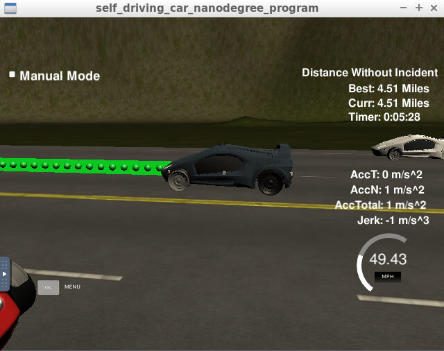

# CarND-Path-Planning-Project
Self-Driving Car Engineer Nanodegree Program
   
### Goals
In this project your goal is to safely navigate around a virtual highway with other traffic that is driving +-10 MPH of the 50 MPH speed limit. You will be provided the car's localization and sensor fusion data, there is also a sparse map list of waypoints around the highway. The car should try to go as close as possible to the 50 MPH speed limit, which means passing slower traffic when possible, note that other cars will try to change lanes too. The car should avoid hitting other cars at all cost as well as driving inside of the marked road lanes at all times, unless going from one lane to another. The car should be able to make one complete loop around the 6946m highway. Since the car is trying to go 50 MPH, it should take a little over 5 minutes to complete 1 loop. Also the car should not experience total acceleration over 10 m/s^2 and jerk that is greater than 10 m/s^3.

## Basic Build Instructions

1. Clone this repo.
2. Make a build directory: `mkdir build && cd build`
3. Compile: `cmake .. && make`
4. Run it: `./path_planning`.

## Details

1. The car uses a perfect controller and will visit every (x,y) point it recieves in the list every .02 seconds. The units for the (x,y) points are in meters and the spacing of the points determines the speed of the car. The vector going from a point to the next point in the list dictates the angle of the car. Acceleration both in the tangential and normal directions is measured along with the jerk, the rate of change of total Acceleration. The (x,y) point paths that the planner recieves should not have a total acceleration that goes over 10 m/s^2, also the jerk should not go over 50 m/s^3. (NOTE: As this is BETA, these requirements might change. Also currently jerk is over a .02 second interval, it would probably be better to average total acceleration over 1 second and measure jerk from that.

2. There will be some latency between the simulator running and the path planner returning a path, with optimized code usually its not very long maybe just 1-3 time steps. During this delay the simulator will continue using points that it was last given, because of this its a good idea to store the last points you have used so you can have a smooth transition. previous_path_x, and previous_path_y can be helpful for this transition since they show the last points given to the simulator controller with the processed points already removed. You would either return a path that extends this previous path or make sure to create a new path that has a smooth transition with this last path.

## SPLINE!!!

A really helpful resource for doing this project and creating smooth trajectories was using http://kluge.in-chemnitz.de/opensource/spline/, the spline function is in a single hearder file is really easy to use.

  
<h1 align="center"> Addressing Project Rubric </h1>

<h2 align="center">Compilation </h2>

<em>Criteria 1 : Code is compiling without errors with cmake and make</em>

<h2 align="center">Valid Trajectories </h2>

<em>Criteria 1 : The car is able to drive at least 4.32 miles without incident. (both in local environment and in Udacity workspace)</em>

<em>Criteria 2 : The car drives according to the speed limit of 50 mph as observed in the simulator.
</em>

<em>Criteria 3 : Max Acceleration and Jerk are not Exceeded as observed in the simulator.
</em>

<em>Criteria 4 : Car does not have collisions with other vehicles on the road as observed in the simulator.
</em>

<em>Criteria 5 : The car stays in its lane, except for the time between changing lanes also transition happens within 3 second as observed in the simulator. </em>

<em>Criteria 6 : The car is able to smoothly change lanes when it is behind a slowly moving car and adjacent lane is clear of traffic as observed in the simulator. </em>

<h2 align="center">Reflection </h2>

<h3>Path Planning</h3>

<h3>Results</h3>

GIF file for the Udacity workspace is shown below.

[Simulation video](./results/local_environment_result.webm) recorded in local environment is also attached.